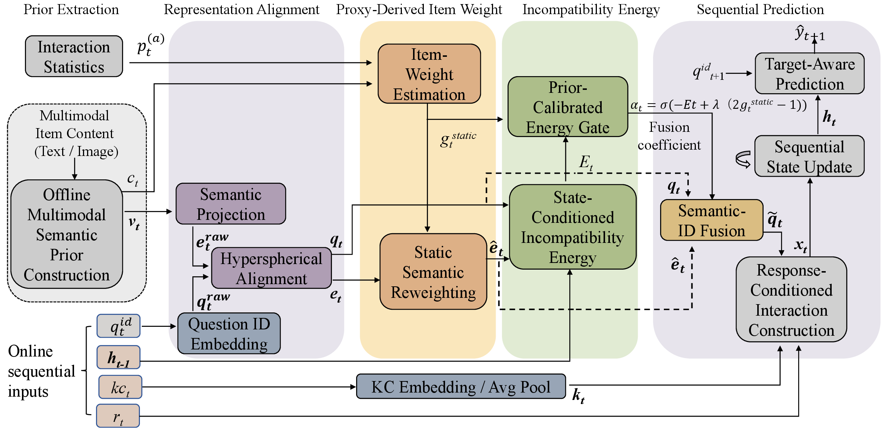

# PCEG

Official implementation of **Prior-Calibrated Energy Gating for Knowledge Tracing with Multimodal Semantic Priors**, accepted by IEEE ICDM 2026.

PCEG combines offline multimodal semantic priors with question-ID and concept representations. A proxy-derived item weight and a learner-state-conditioned energy jointly control the contribution of semantic information during sequential knowledge tracing.



## Installation

The experiments use Python 3.10 and PyTorch 2.6.

```bash
pip install -r requirements.txt
```

## Training

```bash
python scripts/train.py \
  --dataset XES3G5M \
  --encoder qwen3b \
  --sequence-csv <path/to/train_valid_sequences.csv> \
  --semantic-file <path/to/embeddings.pt> \
  --consistency-file <path/to/results_with_consistency.jsonl> \
  --valid-fold 0 \
  --paper-config <path/to/private_config.json> \
  --output-dir <path/to/output>
```

## Testing

```bash
python scripts/evaluate.py \
  --checkpoint <path/to/output/best.pt> \
  --sequence-csv <path/to/test_sequences.csv> \
  --semantic-file <path/to/embeddings.pt> \
  --consistency-file <path/to/results_with_consistency.jsonl> \
  --fold -1 \
  --output-dir <path/to/evaluation>
```

## Data

The DBE-KT22, XES3G5M, and NIPS_task34 datasets are not included in this repository. Please obtain them from their original sources and follow their respective licenses. Extracted semantic features, pretrained model weights, checkpoints, and experiment outputs are also not distributed.

## License

This project is released under the Apache License 2.0.
